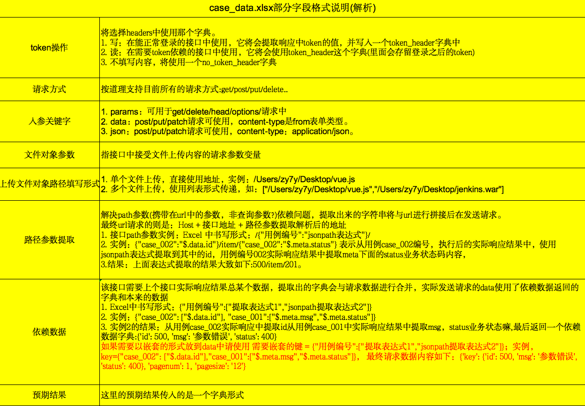
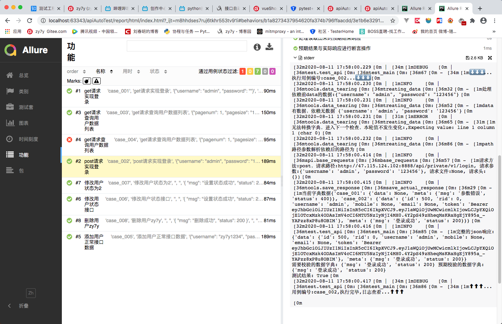

# apiAutoTest

#### 介绍
#### 软件架构
| 名称       | 版本   | 作用 |
| -------- | -------- | ---- |
| python                         | 3.7.8  |      |
| pytest                         | 6.0.1  | 底层单元测试框架,用来实现参数化，自动执行用例 |
| allure-pytest                  | 2.8.17 | allure与pytest的插件可以生成allure的测试报告 |
| jsonpath                       | 0.82   | 用来进行响应断言操作 |
| loguru                         | 0.54   | 记录日志 |
| PyYAML                         | 5.3.1  | 读取yml/yaml格式的配置文件 |
| Allure 												 | 2.13.5 | 要生成allure测试报告必须要在本机安装allure并配置环境变量 |
| xlrd                           | 1.2.0  | 用来读取excel中用例数据 |
| yagmail | 0.11.224 | 测试完成后发送邮件 |
| requests| 2.24.0 | 发送请求 |

#### 安装教程

1.  git clone  https://gitee.com/zy7y/apiAutoTest.git 
2.  使用pycharm打开项目使用Terminal 输入 python3 -m venv venv 新建虚拟环境
3.  执行pip install -r requirements.txt 安装依赖库
4.  修改config.ymal文件中email文件配置收件人邮箱，授权码，发件人邮箱
5.  运行/test/test_api.py 文件
#### 用例说明文档

[点击前往用例说明文档Markdown版](apiAutoTest用例说明.md)

#### 使用说明

1.  本项目直接使用的requests.Session理论上实现了cookie请求的管理，不用单独提取cookie，支持前后端分离项目，兼容Restful接口规范。
2.  项目中token操作中为写时，请务必保证是能正常获得响应并且返回了token字段
3.  本项目用例书写格式请务必遵循，sheet页用例说明中有一部分
4.  该项目找的是b站上的一个前后端分离应用，域名使用的是b站朋友提供的，请大家谨慎操作学习
5.  本项目所要投入生产，请自行修改配置文件config.yaml及用例数据case_data.xlsx，

#### 测试报告

#### 更新
2020/08/08 增加实际响应存储数据的方法，并在字典可以处理依赖见tools/svae_response.py
2020/08/09 实现多文件上传，接口中Path参数依赖处理

#### 博客园首发
https://www.cnblogs.com/zy7y/p/13426816.html

### Jenkins集成

https://www.cnblogs.com/zy7y/p/13448102.html

#### 联系我

QQ：396667207

